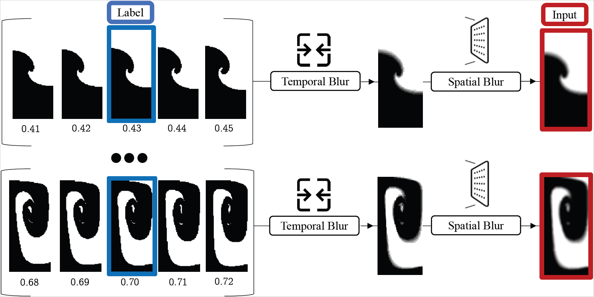

# ClariPhy: Physics-Informed Image Deblurring with Transformers for Hydrodynamic Instability Analysis 


# Introduction
Recent advances in deep learning have greatly improved image deblurring for natural scenes. However, applying these methods to physical experiments, especially those involving rapid, complex dynamics like hydrodynamic instabilities, remains challenging. Unlike conventional deblurring tasks, these scenarios involve motion blur tied to evolving physical processes, complicating image restoration. We propose ClariPhy, a transformer-based approach utilizing the Restormer model, fine-tuned on a novel deblurring dataset derived from Rayleigh-Taylor instability simulations. This dataset features pairs of sharp and artificially spatial and temporal blurred images, reflecting the real-world conditions of physical experiments. Leveraging the self-attention mechanism of transformers, ClariPhy effectively captures spatiotemporal dependencies crucial for deblurring images of dynamic phenomena. Our results show that ClariPhy outperforms the original SOTA Restormer model, providing enhanced clarity and accuracy in time-sensitive physical experiments.


# Instructions
In order to test the fine-tuned model you should create the original restormer enviroment and download the fine tuned model as explained later.
To train or test you need 2 enviroments. 
1. Restormer enviroment (pytorch181) [here](https://github.com/swz30/Restormer/blob/main/INSTALL.md#installation).
2. ClariPhy enviroment.
   
## Requirments
First, clone the code provided here.
```
git clone https://github.com/Scientific-Computing-Lab/ClariPhy.git
```
You may use the file *blur_env.yml* to create anaconda environment with the required packages. To build the package run:
```
conda create --name <ClariPhy> --file blur_env.yml
```
Then, activate your environment:
```
conda activate <ClariPhy>
```


# Citation
For more information about the measures and their means of the implementations, please refer to the paper.
If you found these codes useful for your research, please consider citing: 

# Running

### Scripts
There are several scripts:
1. **blur_python_code.py** - blurres specific file or folder.
2. **build_DB.py** - creating database of blurred images.
3. **DB_org.py/DB_org_small.py** - creates images paired to fit the requrerments of training with the restormer model.
4. **test_folder_example.py** - After trainign you can use this to test the model on a folder.
5. **demo.py** - Edited version of demo.py as explained later. could be exchanges with the origianl demo.py in the Restormer depository.
6. **train.py** - Edited version of train.py as explained later. could be exchanges with the origianl train.py in the Restormer depository.
   


#### Configuration
1. Change the paths in Deblurring_Restormer.yml file to the relevant paths:
```
train:
dataroot_gt:  ./restormer/blur/ClariPhy/train/target
dataroot_lq: ./restormer/blur/ClariPhy/train/input
val:
dataroot_gt: ./restormer/blur/ClariPhy/test/target
dataroot_lq: ./restormer/blur/ClariPhy/test/input
```
2. Change the number of iterations.
3. Change from progressive training to single fixed-patch size.
4. Running on GPU is necessary in order to load our models. Make sure you are using a GPU.

### Test
To test the fine-tuned models, download the models [here](https://drive.google.com/drive/folders/1daqm3VdqUUWxvqipqGbqQLCAGlrj80A7) and place it in the following path: ./Motion_Deblurring/pretrained_models/ (in the Restormer repository). Change the name of the model to  motion_deblurring.pth. Then follow the intructions [here](https://github.com/swz30/Restormer/blob/main/Motion_Deblurring/README.md#testing-on-gopro-dataset).
In case you wan to save the model name (for example, to use test_folder_example.py, explained later), you can save the model name and exchange the file demo.py in the restormer repository to demo.py here. 
To test a single image, change to the pytorch181 enviroment and run:
```
python demo.py --task Motion_Deblurring --input_dir <img_dir> --result_dir <result_dir> --model_name <model_name>
```

To test a single experiment from the RT simultaions, change to the blur enviroment, change the pathes in the tets_folder_example.py to the desired experiment and run:
```
python test_folder_example.py
```
this would create a folder that holds for each time in the experiment the: original, blurred, and deblured images as well as summation figures and the coresponding data. the deblurred images will be created for each model in here: ./Motion_Deblurring/pretrained_models/ 

### Train
To train, first create the database using build_DB.py, make sure to change the pathes to your desired location.
then use DB_org_small.py to create the paired-images database. This code creates DB of 78650 paires of blured-clean images with different levels of blurriness. To create the full database you can use DB_org.py.

To start training, change to the pytorch181 enviroment and run:
```
cd Restormer
./train.sh Motion_Deblurring/Options/Deblurring_Restormer.yml
```

In order to change the size of the training data, in train.py in create_train_val_dataloader add after this row (for train set):

```
train_set = create_dataset(dataset_opt)
```
this 4 rows:
```
smaller_db_ratio = 0.1
rand_idx = np.arange(0, len(train_set), dtype=int)
np.random.shuffle(rand_idx)
train_set = torch.utils.data.Subset(train_set, rand_idx[0:int(smaller_db_ratio*len(train_set))])
```


and add after this row (for val set):
```
val_set = create_dataset(dataset_opt)
```
this 3 rows:
```
rand_idx = np.arange(0, len(val_set), dtype=int)
np.random.shuffle(rand_idx)
val_set = torch.utils.data.Subset(val_set, rand_idx[0:int(smaller_db_ratio * len(train_set))])
```

and change the smaller_db_ratio to the desired ratio.
An eddited script of train.py is uploaded as well an could be exchanges with the original train.py in ./Restormer/basicsr/


# Dataset
The data that was used for training in the paper can be downloaded [here](https://drive.google.com/file/d/1m2d1-AW6ZCpkUjKoWj4McXcqB1HeH5DK/view?usp=sharing).

Raw data before pre-processing can be found in [RayleAI](https://github.com/Scientific-Computing-Lab/SimulAI) repository.
